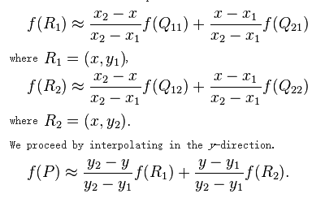
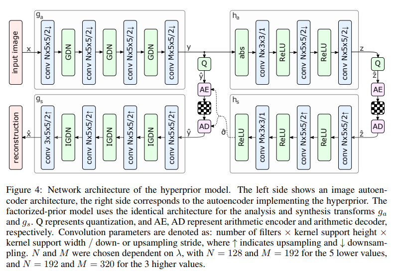

#### 1.sensor CFA滤波器

- RGGB的颜色阵列滤波器.

  1. 最邻近滤波器.

  2. Bilinear:

     - 由周围四个点(二维)加权得到差值

       

  3. HQ linear:

     - 这个是matlab用的差值方法:HIGH-QUALITY LINEAR INTERPOLATION FOR DEMOSAICING OF BAYER-PATTERNED COLOR IMAGES [PDF

       

#### 2.图像视频点云压缩

做过压缩感知成像，用深度学习做过，图像压缩，光谱压缩，也调研过当前比较成功的图像压缩方法．

##### 压缩比赛

CLIC：workshop and challenge on learning image compression(CLIC)

##### 点云压缩

- 优点：精度高，数据结构简单。
- 缺点：数据规模大，无序性与不规则性。
- 基于几何的方法：（G-PCC）
  - 八叉树的方法（OCtree）：算法简单易于实现，计算量大压缩率低，先验不准（邻近属性相似）。
  - 基于图论的方法：压缩性能好，算法复杂、需要额外存储空间。
- 基于视频的方法（V-PCC）
  - 多面投影方法：可利用现有算法，实现方便简洁；缺点是会有空洞，重合点较多。

##### 视频压缩（HEVC 265、264）

##### 图像压缩

- jpg：[具体算法](https://www.cnblogs.com/Arvin-JIN/p/9133745.html)
  - 颜色空间转换。
  - DCT变换
  - 数据量化
  - 变换为以为数组，哈夫曼编码。
- PNG:[具体算法](https://www.cnblogs.com/en-heng/p/4992916.html)
  - 差分编码，类似一个梯度卷积．
  - LZ77：一种基于字典的无损压缩．
  - 结合哈夫曼

##### 深度学习图像压缩

- 很多方法，主要是google,balle的方法．[论文](https://arxiv.org/pdf/1802.01436.pdf)
- 
- 主要结构是encoder与decoder，Ｑ量化层(通过加噪声实现)，AE/AD熵编码层，后边超先验网络学到context model来优化熵编码(利用好空间信息)，设计熵loss来控制中间码流．
- CVP: [著名压缩算法](https://github.com/lumingzzz)