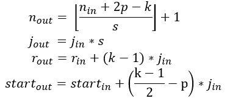

#### 优化策略

##### BN batch normalization

---

#### loss function

- 这里的loss指的是loss function,有时候会和参数正则化的loss混淆.

##### Total Variation loss

-  用在输出的单张图像上,可以取\beta=1,严格来说，是对输出图像的正则化
-  会使图像平滑,那么如果改成绝对值,是不是就可以保留边缘?

$$
Loss_{TV} = \frac{1}{NM}\sum({\Delta x}^2 + {\Delta y}^2)^\frac{\beta}{2}
$$

##### Perceptual loss

- 计算GT与输出分别通过VGG网络之后的L2loss.

$$
Loss_P = \frac{1}{NM}\sum(VGG(\hat{X}) - VGG(X))^2
$$

##### L2_loss/MSE

- 或者叫均方误差(MSE),最小二乘法.L2loss也指对参数的正则化.
- 使用这个loss图像更加平滑,PSNR较高.

##### SSIM

- 结构相似性[详解](https://blog.csdn.net/leviopku/article/details/84635897)
  - 主要分成三块:亮度比较\对比度比较\结构比较.
  - 
- SSIM_loss可以得到较好的主观质量，此结论基于相关实验．
- 除此之外还有MS-SSIM，多尺度，每个尺度^{weight}之后相乘．
- 除此之外还有很多改进版本，未了解．

##### triplet-center loss

---

#### 几个概念

- fine-tuning：利用现有的网络，进一步微调或者用于特征提取．

---

#### 目标检测中的几个网络

先要区别一下几个任务：

- 分类：图像分类任务．
- 目标检测：分类加回归（定位），输出位置框．
- 图像分割/实例分割：对目标的精确边界进行分割．

主要有三類方法:

- 传统的目标检测算法：Cascade + HOG/DPM + Haar/SVM以及上述方法的诸多改进、优化；
- 候选区域/框 + 深度学习分类：通过提取候选区域，并对相应区域进行以深度学习方法为主的分类的方案
- 基于深度学习的回归方法：YOLO/SSD/DenseBox 等方法

##### 傳統方法

- 步驟:
  - 區域選擇: 一般使用穷举策略,滑动窗口.
  - 特征提取: SIFT/HOG
  - 分类器: SVM/Adaboost

##### RCNN

- Selective Search + CNN + SVM
- 1.Selective Search算法,寻找候选框.
- 2.将候选区域缩放成统一大小送进CNN得到特征.
- 3.将特征送进SVM分类.(训练20个SVM)
- 4.边框回归.

##### SPP-net

- ROI-pooloing, 使用的是空间金字塔

##### fast-RCNN

- 使用单层7x7的ROIpooling.7x7x512的特征维度.
- 使用softmax代替SVM实现多任务分类.

##### Faster-RCNN

速度不够块的原因?

- 自动框搜索.RPN,anchor box.
- 

##### YOLO

- 

##### SSD

---

#### 小问题

##### 卷积中的计算

#### 图像压缩网络思想

#### RNN系列

#### STN

[STN](https://www.jianshu.com/p/784ab304e956?from=groupmessage)

